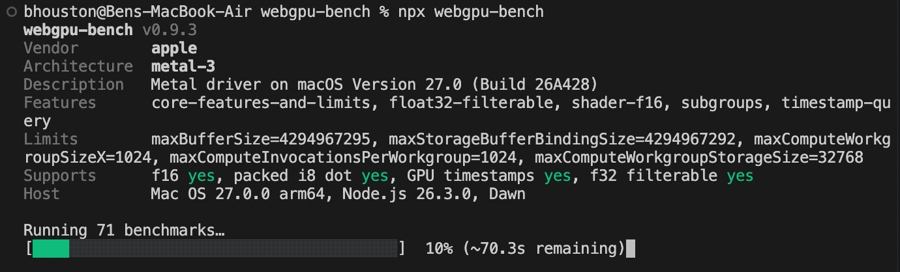
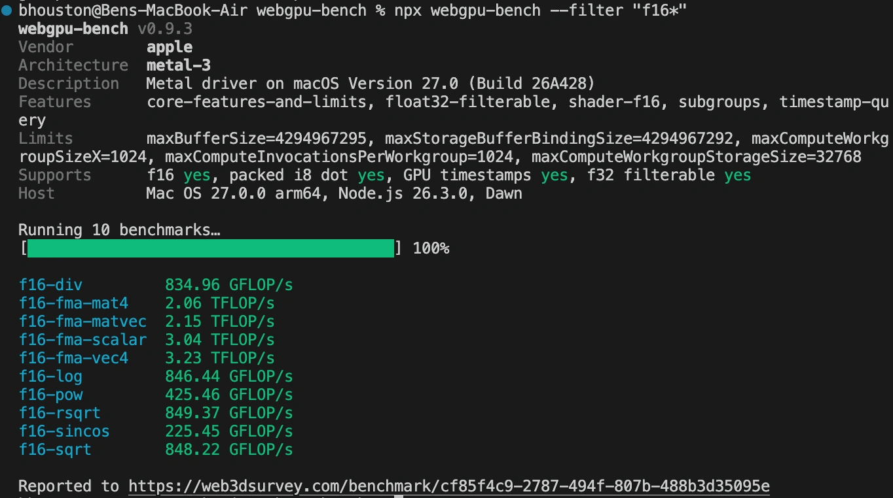
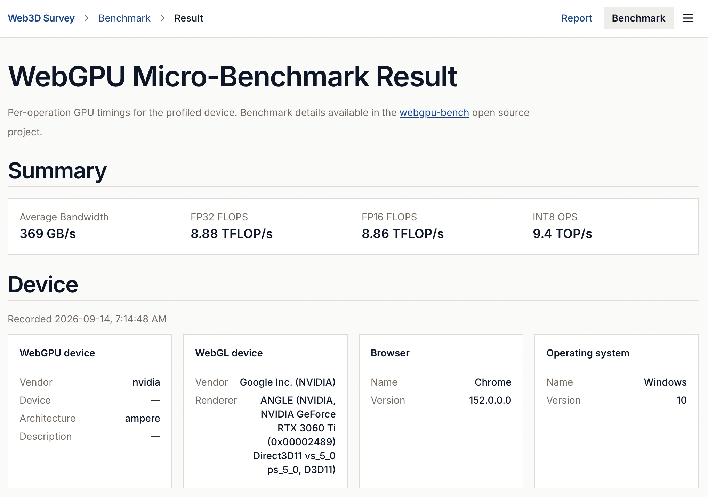

# webgpu-bench (monorepo)

[](https://github.com/bhouston/webgpu-bench/actions/workflows/ci.yml)
[](https://codecov.io/gh/bhouston/webgpu-bench)
[](https://www.npmjs.com/package/webgpu-bench)
[](https://web3dsurvey.com/benchmark)

A microbenchmark suite for WebGPU: it isolates and benchmarks a device's raw ceilings — memory
**bandwidth** (read/write) and **FLOPS** (fp32, fp16, int8; scalar/vec4/mat4/matvec) — one operation at a
time in the browser, plus fixed-work comparisons of shader techniques such as layouts, workgroup sizes,
reductions, and atomic aggregation. It is not a full app or game benchmark.

Try it live on the [Web3D Survey: GPU Benchmark page](https://web3dsurvey.com/benchmark). Read the
[announcement post](https://ben3d.ca/blog/introducing-webgpu-bench).

This is a **micro-benchmark**, not a game or app benchmark: it tells you the raw cost of specific
operations (a memory read, an fp32 FMA, an int8 dot product, a divergent branch) on _your_ GPU, so you can
make better-informed decisions when writing shaders — and understand how those costs differ across
devices. Use it as a CLI or as a library embedded in your own tools.

## Packages

- [`packages/core`](packages/core) — `webgpu-bench-core`, the benchmark suite (WGSL shaders, data
  generation, timing harness, orchestration). Framework-agnostic, browser-only, consumed as TypeScript
  source. See its [README](packages/core/README.md).
- [`packages/cli`](packages/cli) — `webgpu-bench` command-line runner (WebGPU via Dawn, no browser
  needed). See its [README](packages/cli/README.md).

## Screenshots





## Development

Follow [CONTRIBUTING.md](CONTRIBUTING.md) for the issue, branch, PR, and release workflow.
See [release setup](docs/releases.md) for npm trusted publishing.

```bash
pnpm install
pnpm exec playwright install chromium webkit
pnpm build
pnpm lint
pnpm tsc
pnpm test
```

The default test command runs Chromium, Node, and CLI tests with coverage. WebKit is a separate advisory CI job; `pnpm test:all` runs all projects locally.

```bash
pnpm --filter webgpu-bench-core test:browser   # Both browsers (macOS with WebGPU)
pnpm --filter webgpu-bench-core test:chromium # Chromium only
pnpm --filter webgpu-bench-core test:webkit   # WebKit only
```

## Author

Created by [Ben Houston](https://ben3d.ca) and sponsored by [Land of Assets](https://landofassets.com).
